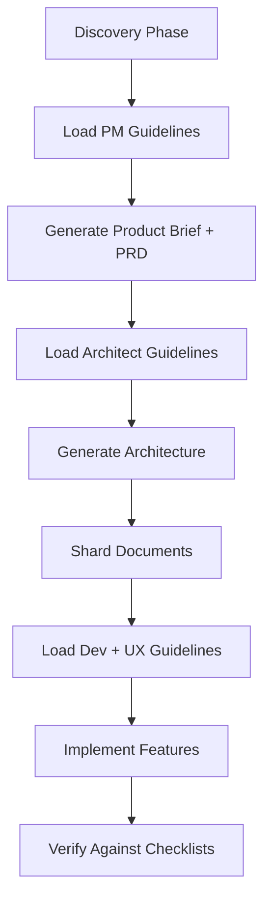

# B-MAD Agent Guidelines - Usage Instructions

## 📂 File Organization

Place these files in your project directory structure:

```
your-project/
├── docs/
│   └── _bmad-guidelines/
│       ├── README.md (this file)
│       ├── bmad-pm-agent-guidelines.md
│       ├── bmad-architect-agent-guidelines.md
│       ├── bmad-dev-agent-guidelines.md
│       └── bmad-ux-agent-guidelines.md
```

## 🎯 When to Load Each File

### Planning Phase (Claude Code)

#### 1. Product Brief Generation
```bash
claude code

/product-brief

Load: docs/_bmad-guidelines/bmad-pm-agent-guidelines.md

Then proceed with product brief generation based on discovery docs.
```

#### 2. PRD Generation
```bash
/prd

Load:
- docs/_bmad-guidelines/bmad-pm-agent-guidelines.md
- docs/0-discovery/solution-discovery.md
- docs/1-planning/product-brief.md

Generate PRD following the guidelines (≤5 MUST-HAVE features, detailed acceptance criteria).
```

#### 3. Architecture Generation
```bash
/architecture

Load:
- docs/_bmad-guidelines/bmad-architect-agent-guidelines.md
- docs/2-requirements/prd/functional-requirements.md

Generate architecture following Supabase-first principles, include complete database schema with RLS.
```

---

### Implementation Phase (Cursor)

#### 4. Database Schema Setup (Day 1)
```bash
# In Cursor chat
@bmm-architect

Load:
- docs/_bmad-guidelines/bmad-architect-agent-guidelines.md
- docs/2-requirements/architecture/database-schema.md

Generate SQL migrations with RLS policies, indexes, and TypeScript type generation commands.
```

#### 5. Frontend Development (Day 2-7)
```bash
# New Cursor chat for frontend
@bmm-dev

Load:
- docs/_bmad-guidelines/bmad-dev-agent-guidelines.md
- docs/_bmad-guidelines/bmad-ux-agent-guidelines.md
- docs/design-system/design-system.md

Implement [specific component/page] following TypeScript strict mode, error handling patterns.
```

#### 6. Backend API Development (Day 3-10)
```bash
# New Cursor chat for backend
@bmm-dev

Load:
- docs/_bmad-guidelines/bmad-dev-agent-guidelines.md
- docs/2-requirements/architecture/api-specification.md

Implement API route [specific route] using the API Route Template with Zod validation, auth checks, error handling.
```

#### 7. UX Design (Before Implementation)
```bash
# In Claude Code (better for design thinking)
claude code

@bmm-ux

Load:
- docs/_bmad-guidelines/bmad-ux-agent-guidelines.md
- docs/0-discovery/solution-discovery.md

Create UX design for [specific screen] using shadcn/ui + Aceternity UI + Tremor components.
```

---

## 📋 Quick Reference: Which File for What

| Task | Agent | Guideline File | Key Content |
|------|-------|----------------|-------------|
| Generate PRD | PM | `bmad-pm-agent-guidelines.md` | Scope management, acceptance criteria, non-functional requirements |
| Design architecture | Architect | `bmad-architect-agent-guidelines.md` | Database schema, RLS, failure modes, security |
| Implement features | Dev | `bmad-dev-agent-guidelines.md` | TypeScript patterns, API templates, Supabase client usage |
| Design screens | UX | `bmad-ux-agent-guidelines.md` | Component library selection, wireframes, interaction patterns |

---

## ✅ Pre-Flight Checklist

Before starting B-MAD workflow:

- [ ] All guideline files placed in `docs/_bmad-guidelines/`
- [ ] Discovery docs completed in `docs/0-discovery/`
- [ ] Component library research saved (if UX work needed)
- [ ] Ready to load appropriate guideline file for each agent

---

## 🚀 Example: Complete Workflow

```bash
# ===== PLANNING PHASE (Claude Code) =====

# Step 1: Product Brief
claude code
/product-brief
Load: docs/_bmad-guidelines/bmad-pm-agent-guidelines.md
[Generate product brief]

# Step 2: PRD
/prd
Load: docs/_bmad-guidelines/bmad-pm-agent-guidelines.md
[Generate PRD]

# Step 3: Architecture
/architecture
Load: docs/_bmad-guidelines/bmad-architect-agent-guidelines.md
[Generate architecture]

# Step 4: Shard documents
/bmad:bmm:agents:po
[Shard PRD and Architecture]

# ===== IMPLEMENTATION PHASE (Cursor) =====

# Step 5: Database Setup (Cursor Chat 1)
@bmm-architect
Load: docs/_bmad-guidelines/bmad-architect-agent-guidelines.md
[Generate SQL migrations]

# Step 6: Frontend (Cursor Chat 2)
@bmm-dev
Load: docs/_bmad-guidelines/bmad-dev-agent-guidelines.md
Load: docs/_bmad-guidelines/bmad-ux-agent-guidelines.md
[Implement UI components]

# Step 7: Backend (Cursor Chat 3)
@bmm-dev
Load: docs/_bmad-guidelines/bmad-dev-agent-guidelines.md
[Implement API routes]

# ===== VERIFICATION =====

# Check RLS policies
Run SQL: SELECT tablename, rowsecurity FROM pg_tables WHERE schemaname = 'public';

# Check TypeScript types
Run: npm run type-check

# Check for common mistakes
Review against checklists in guideline files
```

---

## 💡 Tips for Success

### 1. Load Guidelines at START of Each Task
Don't wait until you run into issues—load the relevant guideline file immediately when starting a new task with an agent.

### 2. Reference Specific Sections
When loading guidelines, you can reference specific sections:

```bash
@bmm-dev

Load: docs/_bmad-guidelines/bmad-dev-agent-guidelines.md

Focus on: Issue #2 (API Route Template)

Implement POST /api/jobs route following the exact template structure.
```

### 3. Use Checklists Before Moving Forward
Each guideline file has a "Pre-Flight Checklist" section. Don't proceed to the next phase until you've verified all items.

### 4. Keep Guidelines Updated
If you discover new common issues or better patterns, update the relevant guideline file and commit to git.

---

## 🔄 Workflow Integration with B-MAD

These guidelines are designed to work seamlessly with B-MAD's workflow:



---

## 📚 Additional Resources

- **Component Library Research:** See artifact "React Component Libraries for LinkedIn Referral Finder MVP"
- **B-MAD Official Docs:** https://bmadcodes.com/user-guide
- **Supabase RLS Guide:** https://supabase.com/docs/guides/auth/row-level-security
- **shadcn/ui Components:** https://ui.shadcn.com/docs/components

---

**Remember:** These guidelines are living documents. Update them as you discover new patterns or encounter new issues during development.# B-MAD Agent Guidelines - Usage Instructions

## 📂 File Organization

Place these files in your project directory structure:

```
your-project/
├── docs/
│   └── _bmad-guidelines/
│       ├── README.md (this file)
│       ├── bmad-pm-agent-guidelines.md
│       ├── bmad-architect-agent-guidelines.md
│       ├── bmad-dev-agent-guidelines.md
│       └── bmad-ux-agent-guidelines.md
```

## 🎯 When to Load Each File

### Planning Phase (Claude Code)

#### 1. Product Brief Generation
```bash
claude code

/product-brief

Load: docs/_bmad-guidelines/bmad-pm-agent-guidelines.md

Then proceed with product brief generation based on discovery docs.
```

#### 2. PRD Generation
```bash
/prd

Load:
- docs/_bmad-guidelines/bmad-pm-agent-guidelines.md
- docs/0-discovery/solution-discovery.md
- docs/1-planning/product-brief.md

Generate PRD following the guidelines (≤5 MUST-HAVE features, detailed acceptance criteria).
```

#### 3. Architecture Generation
```bash
/architecture

Load:
- docs/_bmad-guidelines/bmad-architect-agent-guidelines.md
- docs/2-requirements/prd/functional-requirements.md

Generate architecture following Supabase-first principles, include complete database schema with RLS.
```

---

### Implementation Phase (Cursor)

#### 4. Database Schema Setup (Day 1)
```bash
# In Cursor chat
@bmm-architect

Load:
- docs/_bmad-guidelines/bmad-architect-agent-guidelines.md
- docs/2-requirements/architecture/database-schema.md

Generate SQL migrations with RLS policies, indexes, and TypeScript type generation commands.
```

#### 5. Frontend Development (Day 2-7)
```bash
# New Cursor chat for frontend
@bmm-dev

Load:
- docs/_bmad-guidelines/bmad-dev-agent-guidelines.md
- docs/_bmad-guidelines/bmad-ux-agent-guidelines.md
- docs/design-system/design-system.md

Implement [specific component/page] following TypeScript strict mode, error handling patterns.
```

#### 6. Backend API Development (Day 3-10)
```bash
# New Cursor chat for backend
@bmm-dev

Load:
- docs/_bmad-guidelines/bmad-dev-agent-guidelines.md
- docs/2-requirements/architecture/api-specification.md

Implement API route [specific route] using the API Route Template with Zod validation, auth checks, error handling.
```

#### 7. UX Design (Before Implementation)
```bash
# In Claude Code (better for design thinking)
claude code

@bmm-ux

Load:
- docs/_bmad-guidelines/bmad-ux-agent-guidelines.md
- docs/0-discovery/solution-discovery.md

Create UX design for [specific screen] using shadcn/ui + Aceternity UI + Tremor components.
```

---

## 📋 Quick Reference: Which File for What

| Task | Agent | Guideline File | Key Content |
|------|-------|----------------|-------------|
| Generate PRD | PM | `bmad-pm-agent-guidelines.md` | Scope management, acceptance criteria, non-functional requirements |
| Design architecture | Architect | `bmad-architect-agent-guidelines.md` | Database schema, RLS, failure modes, security |
| Implement features | Dev | `bmad-dev-agent-guidelines.md` | TypeScript patterns, API templates, Supabase client usage |
| Design screens | UX | `bmad-ux-agent-guidelines.md` | Component library selection, wireframes, interaction patterns |

---

## ✅ Pre-Flight Checklist

Before starting B-MAD workflow:

- [ ] All guideline files placed in `docs/_bmad-guidelines/`
- [ ] Discovery docs completed in `docs/0-discovery/`
- [ ] Component library research saved (if UX work needed)
- [ ] Ready to load appropriate guideline file for each agent

---

## 🚀 Example: Complete Workflow

```bash
# ===== PLANNING PHASE (Claude Code) =====

# Step 1: Product Brief
claude code
/product-brief
Load: docs/_bmad-guidelines/bmad-pm-agent-guidelines.md
[Generate product brief]

# Step 2: PRD
/prd
Load: docs/_bmad-guidelines/bmad-pm-agent-guidelines.md
[Generate PRD]

# Step 3: Architecture
/architecture
Load: docs/_bmad-guidelines/bmad-architect-agent-guidelines.md
[Generate architecture]

# Step 4: Shard documents
/bmad:bmm:agents:po
[Shard PRD and Architecture]

# ===== IMPLEMENTATION PHASE (Cursor) =====

# Step 5: Database Setup (Cursor Chat 1)
@bmm-architect
Load: docs/_bmad-guidelines/bmad-architect-agent-guidelines.md
[Generate SQL migrations]

# Step 6: Frontend (Cursor Chat 2)
@bmm-dev
Load: docs/_bmad-guidelines/bmad-dev-agent-guidelines.md
Load: docs/_bmad-guidelines/bmad-ux-agent-guidelines.md
[Implement UI components]

# Step 7: Backend (Cursor Chat 3)
@bmm-dev
Load: docs/_bmad-guidelines/bmad-dev-agent-guidelines.md
[Implement API routes]

# ===== VERIFICATION =====

# Check RLS policies
Run SQL: SELECT tablename, rowsecurity FROM pg_tables WHERE schemaname = 'public';

# Check TypeScript types
Run: npm run type-check

# Check for common mistakes
Review against checklists in guideline files
```

---

## 💡 Tips for Success

### 1. Load Guidelines at START of Each Task
Don't wait until you run into issues—load the relevant guideline file immediately when starting a new task with an agent.

### 2. Reference Specific Sections
When loading guidelines, you can reference specific sections:

```bash
@bmm-dev

Load: docs/_bmad-guidelines/bmad-dev-agent-guidelines.md

Focus on: Issue #2 (API Route Template)

Implement POST /api/jobs route following the exact template structure.
```

### 3. Use Checklists Before Moving Forward
Each guideline file has a "Pre-Flight Checklist" section. Don't proceed to the next phase until you've verified all items.

### 4. Keep Guidelines Updated
If you discover new common issues or better patterns, update the relevant guideline file and commit to git.

---

## 🔄 Workflow Integration with B-MAD

These guidelines are designed to work seamlessly with B-MAD's workflow:


---

## 📚 Additional Resources

- **Component Library Research:** See artifact "React Component Libraries for LinkedIn Referral Finder MVP"
- **B-MAD Official Docs:** https://bmadcodes.com/user-guide
- **Supabase RLS Guide:** https://supabase.com/docs/guides/auth/row-level-security
- **shadcn/ui Components:** https://ui.shadcn.com/docs/components

---

**Remember:** These guidelines are living documents. Update them as you discover new patterns or encounter new issues during development.